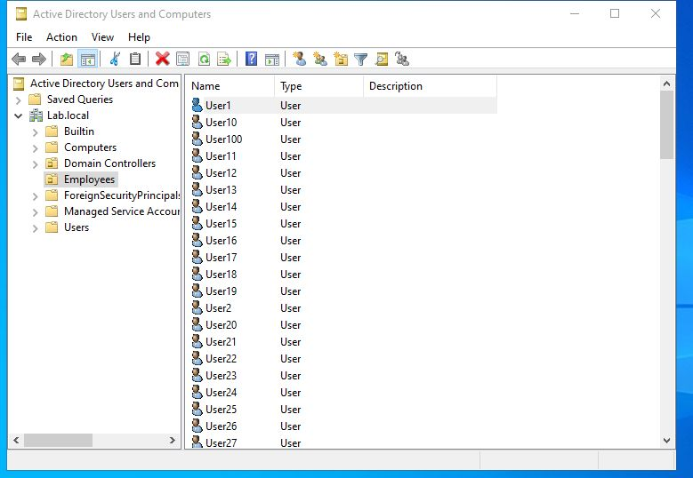
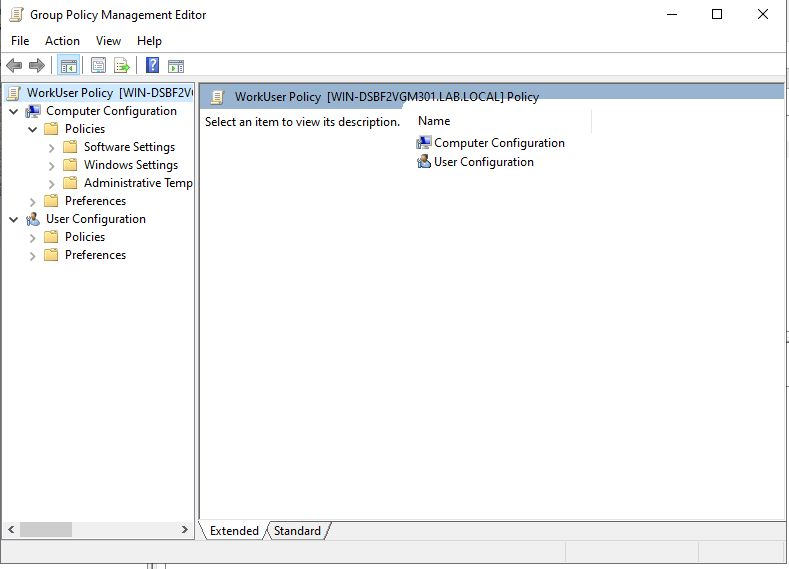
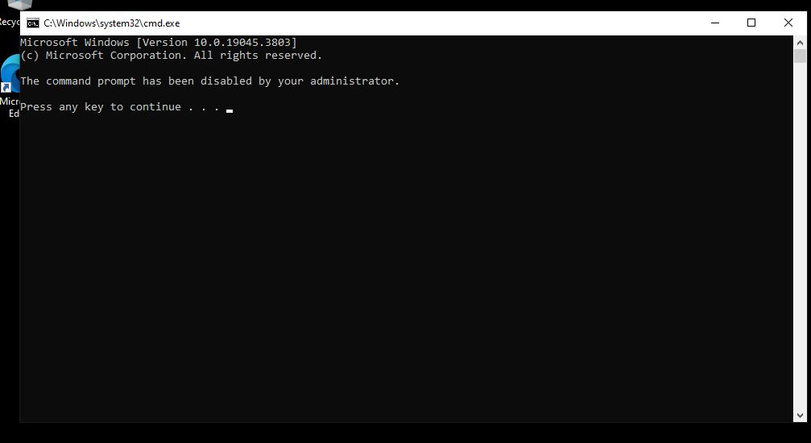
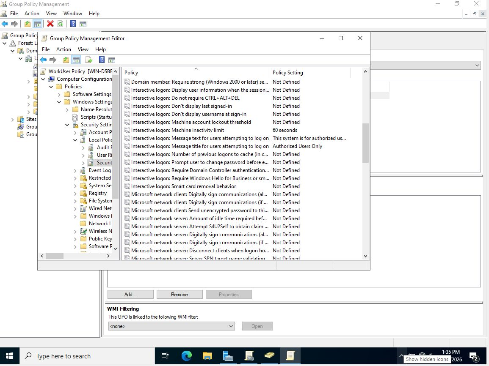
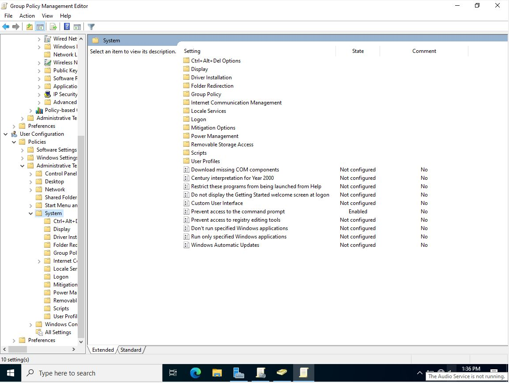

# 🖥️ Active Directory Homelab

A fully functional Active Directory environment built from scratch using VirtualBox and Windows Server 2022. This project simulates a real enterprise IT environment and demonstrates core sysadmin and help desk skills.

---

## 📋 Project Overview

| Component | Details |
|---|---|
| **Hypervisor** | Oracle VirtualBox |
| **Domain Controller** | Windows Server 2022 |
| **Domain Name** | Lab.local |
| **Workstation** | Windows 10 Pro |
| **Users Created** | 100+ (via PowerShell) |
| **Network Type** | Internal Network (intnet) |

---

## 🎯 Objectives

- Deploy Windows Server 2022 as a Domain Controller in a virtualized environment
- Automate bulk user account creation using PowerShell scripting
- Join a Windows 10 Pro workstation to the domain
- Enforce security policies across the domain using Group Policy Objects (GPOs)
- Practice real-world help desk tasks including account management and troubleshooting

---

## 🛠️ Technologies Used

- **Oracle VirtualBox** — Virtualization platform
- **Windows Server 2022** — Domain Controller OS
- **Windows 10 Pro** — Domain-joined workstation
- **Active Directory Domain Services (AD DS)** — Directory service
- **PowerShell** — Automation and scripting
- **Group Policy Management (GPO)** — Security policy enforcement

---

## 📁 Project Structure

```
Active-Directory-Homelab/
├── README.md
├── scripts/
│   └── bulk_users.ps1       # PowerShell script to create 100+ users
└── screenshots/
    ├── 01-users-in-ad.png       # 100 users in Employees OU
    ├── 02-gpo-editor.png        # WorkUser GPO configured
    ├── 03-cmd-disabled.png      # CMD disabled by GPO on workstation
    ├── 04-security-policies.png # Login banner + inactivity lock
    └── 05-gpo-enabled.png       # Prevent CMD policy enabled
```

---

## ⚙️ Setup & Configuration

### Phase 1 — Domain Controller Setup
1. Created a Windows Server 2022 VM in VirtualBox (2 CPU cores, 2GB RAM, 50GB disk)
2. Configured network adapter to **Internal Network** (`intnet`) for VM-to-VM communication
3. Set a **static IP** inside the VM (`192.168.1.10`, DNS: `127.0.0.1`)
4. Installed **Active Directory Domain Services (AD DS)** role via Server Manager
5. Promoted server to **Domain Controller** and created the `Lab.local` domain

### Phase 2 — User Automation with PowerShell
- Created an **Employees** Organizational Unit (OU)
- Wrote and executed `bulk_users.ps1` to bulk-provision **100+ user accounts**
- Script uses `New-ADUser` cmd let with standardized naming, passwords, and OU placement

### Phase 3 — Workstation Setup
1. Created a Windows 10 Pro VM (2 CPU cores, 2GB RAM, 50GB disk)
2. Set network adapter to **Internal Network** (`intnet`)
3. Configured static IP (`192.168.1.20`) with DNS pointing to DC (`192.168.1.10`)
4. Joined the workstation to the `Lab.local` domain

### Phase 4 — Group Policy Configuration
Created and linked **WorkUser Policy** GPO to `Lab.local` with the following settings:

| Policy | Setting | Location |
|---|---|---|
| Login Warning Banner | "Authorized Users Only" | Computer Config → Security Settings → Local Policies |
| Session Inactivity Lock | 60 seconds | Computer Config → Security Settings → Local Policies |
| Disable Command Prompt | Enabled | User Config → Admin Templates → System |

---

## 📜 PowerShell Script

```powershell
# bulk_users.ps1 — Bulk create 100+ AD users
Import-Module ActiveDirectory

$password = ConvertTo-SecureString "P@ssword123" -AsPlainText -Force
$ou = "OU=Employees,DC=Lab,DC=local"

New-ADOrganizationalUnit -Name "Employees" -Path "DC=Lab,DC=local"

1..100 | ForEach-Object {
    $name = "User$_"
    New-ADUser `
        -Name $name `
        -GivenName "User" `
        -Surname "$_" `
        -SamAccountName $name `
        -UserPrincipalName "$name@Lab.local" `
        -Path $ou `
        -AccountPassword $password `
        -Enabled $true
}

Write-Host "100 users created successfully!"
```

---

## 👤 Help Desk Tasks Practiced

- 🔒 **Unlock accounts** — via GUI and `Unlock-ADAccount`
- 🔑 **Reset passwords** — via GUI and `Set-ADAccountPassword`
- ❌ **Disable users** — via GUI and `Disable-ADAccount`
- 📁 **Move users between OUs** — offboarding workflow to Disabled OU
- ✅ **Verify GPO application** — using `gpupdate /force` and `gpresult /r`

---

## 📸 Screenshots

### Active Directory Users and Computers — 100 Users Created


### Group Policy Management Editor


### CMD Disabled by GPO on Workstation


### Security Policies Configured


### Prevent CMD Access — Enabled


---

## 🔍 Key Takeaways

- Gained hands-on experience with **Active Directory** administration in a simulated enterprise environment
- Learned how **Group Policy** propagates from Domain Controller to domain-joined workstations
- Practiced **PowerShell scripting** for IT automation and user lifecycle management
- Troubleshot real configuration errors including network adapter misconfiguration and OS edition compatibility issues

---

## 📌 Skills Demonstrated

`Active Directory` `Windows Server 2022` `PowerShell` `Group Policy (GPO)` `VirtualBox` `Virtualization` `DNS` `Help Desk` `Identity Management` `Sysadmin`

---

*Built as part of hands-on IT/Cybersecurity homelab practice*
